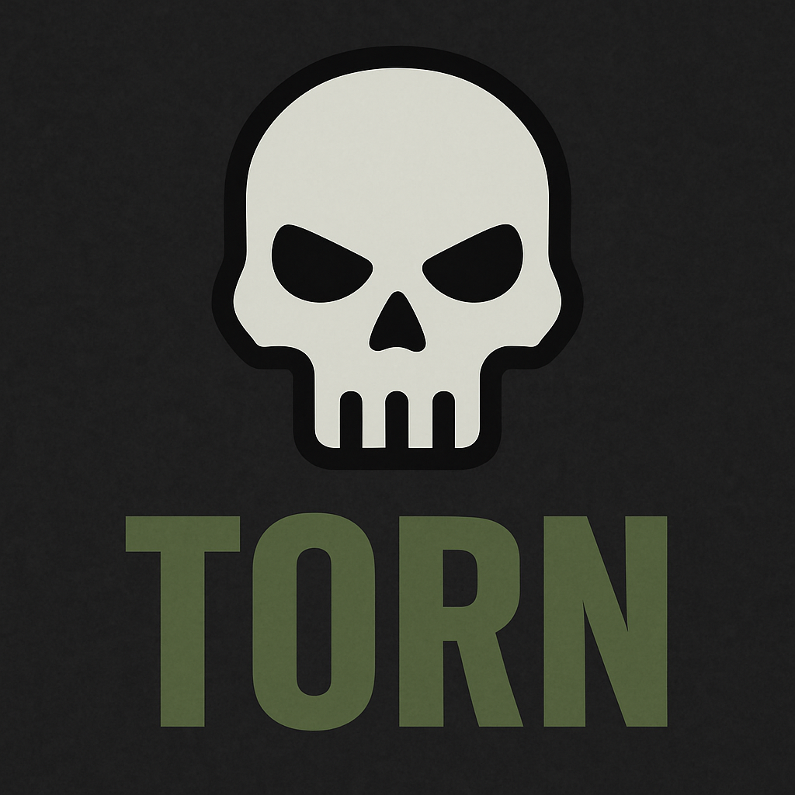

# ioBroker.torn



**Torn City API Adapter for ioBroker**  
This adapter connects your ioBroker system to the [Torn City API](https://www.torn.com/api.html), allowing you to monitor and react to in-game events using your smart home.
[🇩🇪 Deutsche Anleitung](doc/de/README.md)

---

## 🔧 Features

- Connects to Torn using your personal API key
- Fetches basic user information (name, status, level)
- Retrieves events, notifications, and attack history
- Enables automation (e.g., turn lights red when attacked)

---

## 🚀 Installation (Developer Mode)

```bash
git clone https://github.com/YOUR_GITHUB/iobroker.torn
cd iobroker.torn
npm install
iobroker add torn --host YOUR_HOSTNAME
```

> Alternatively update with `iobroker upload torn`.

---

## ⚙️ Configuration

In the adapter settings (Admin UI), enter your personal [Torn API key](https://www.torn.com/preferences.php?tab=api).  
Make sure the key has the required access scopes enabled (`user:basic`, `user:events`, `user:attacks` at minimum).

---

## 📡 Example Use Case: Attack Alert

The adapter can regularly check if you've been attacked in-game. For example:

- When you're attacked, a datapoint like `torn.alerts.attack` is set to `true`.
- You can respond using ioBroker logic or scripts:
  - Turn living room light red
  - Send a Telegram message
  - Trigger a sound on Alexa or another device

> Currently in development — ideas and feature requests welcome!

---

## 🔜 Planned Features

- Detailed attack log processing (`attacks`)
- Push notifications via ioBroker states, Telegram, or Alexa
- Monitoring selected player IDs
- Faction data, war alerts
- Integration into VIS dashboards

---

## 🧙‍♂️ Developer

This adapter is maintained by **Rumblestilzchen**  
Feel free to reach out for suggestions, contributions or collaboration.

---

## 📜 License

GNU General Public License v3.0 — see [LICENSE](LICENSE) for details.
